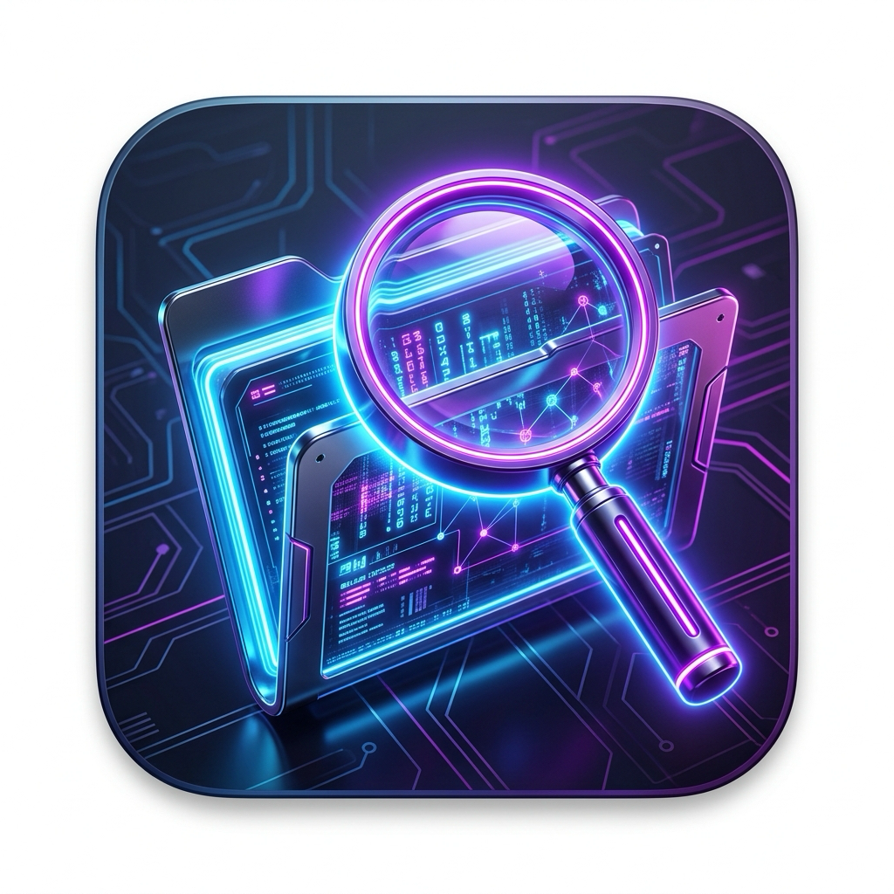

<p align="center">
  
</p>

<h1 align="center">FileCounter Pro</h1>

<p align="center">
  <b>A powerful, offline Mac utility suite with a sci-fi cyberpunk interface.</b><br>
  Built natively in Swift 6 + SwiftUI for Apple Silicon.
</p>

<p align="center">
  
  
  
  
</p>

---

## ✨ What is FileCounter Pro?

FileCounter Pro is an **all-in-one Mac system utility** that runs entirely offline on your machine. It combines 7 powerful tools into one app with a dark sci-fi UI:

| Module | What it does |
|---|---|
| 📊 **Dashboard** | Drag & drop any folder or app to analyze its contents, file types, and sizes |
| 🔍 **Duplicate Finder** | Find and remove duplicate files wasting your storage |
| 🛡️ **Deep Virus Scanner** | Scan files of any size for malicious signatures with zero memory overhead |
| ⚡ **Activity Monitor** | Live CPU, GPU, RAM, memory pressure & system health gauges with AI process analysis |
| 🗑️ **Smart Uninstaller** | Uninstall apps completely — finds hidden leftover caches, preferences, and support files |
| 🧹 **System Junk Scanner** | Deep scan your entire file system for hidden caches, logs, Xcode junk, old iOS backups |
| 🎮 **Mac Gaming** | Check which games your Mac can run via translation layers (GPTK, CrossOver, Rosetta) |

### Key Highlights

- 🌑 **Dark Sci-Fi UI** — Neon cyan, magenta, and purple accents with glow effects
- 🤖 **AI-Powered Analysis** — Every module has built-in AI that explains what files are, whether they're safe to delete, and what processes are doing
- 🔒 **100% Offline** — No data ever leaves your Mac. No accounts, no telemetry, no internet required
- ⚡ **Native Performance** — Built with pure SwiftUI, compiled directly for Apple Silicon with `-O` optimization
- 📐 **Fully Flexible Layout** — Resize the window to any size; the UI adapts smoothly

---

## 🛠️ Requirements

| Requirement | Details |
|---|---|
| **Mac** | Any Mac with Apple Silicon chip (M1, M2, M3, M4 or newer) |
| **macOS** | macOS 27 Golden Gate or later |

---

## 📥 How to Install on Your Mac

### Step 1 — Install Xcode Command Line Tools (one-time setup)

If you've never used Terminal before, don't worry! Open the **Terminal** app (search "Terminal" in Spotlight with `⌘ + Space`), then paste this and press Enter:

```bash
xcode-select --install
```

A popup will appear — click **Install** and wait for it to finish. This installs the Swift compiler needed to build the app.

### Step 2 — Download the App

In Terminal, paste these commands one by one and press Enter after each:

```bash
git clone https://github.com/AnkanRoy/FileCounterPro.git
```

```bash
cd FileCounterPro
```

### Step 3 — Build & Install

```bash
chmod +x build.sh && ./build.sh
```

Wait about 30 seconds. When you see `✅ Successfully built FileCounter.app`, run:

```bash
cp -R FileCounter.app /Applications/
```

### Step 4 — Open the App

```bash
open -a /Applications/FileCounter.app
```

Or find **FileCounter** in your Applications folder / Launchpad and double-click it!

### ⚠️ "App Can't Be Opened" Warning (First Time Only)

macOS blocks apps from unknown developers the first time. Here's how to fix it:

1. Go to **Apple Menu () → System Settings → Privacy & Security**
2. Scroll down — you'll see a message saying *"FileCounter was blocked"*
3. Click **"Open Anyway"**
4. Click **Open** in the confirmation popup
5. The app will work normally from now on

### 🗑️ How to Uninstall

Just drag **FileCounter** from your Applications folder into the Trash. Done!

---

## 🚀 How to Use

### Dashboard (Folder Analyzer)
1. Open the app and click **Dashboard** in the sidebar
2. **Drag & drop** any folder or `.app` file onto the drop zone, or click **Browse Files**
3. The app will scan all files and display them with AI-categorized icons (safe / important / suspicious)
4. Click the **AI Pro** button next to any file for a detailed AI explanation

### Deep Virus Scanner
1. Click **Virus Scanner** in the sidebar
2. Drop a file or click **Select Drive / File**
3. The scanner reads files in chunks (zero memory overhead — safe for multi-GB files)
4. Results show clean ✅ or malicious ❌ with AI threat analysis

### Activity Monitor
1. Click **Activity Monitor** in the sidebar
2. See live **CPU, GPU, RAM, Memory Pressure, and System Health** gauges
3. The process list shows all running processes with **AI Pro** buttons to explain what each process does
4. Click **"Compare M4 GPU vs AMD & NVIDIA"** to see where your Mac stands against PC GPUs
5. Click **"Analyze Mac Health"** for a full hardware diagnostic

### Smart Uninstaller
1. Click **Smart Uninstaller** in the sidebar
2. The app automatically scans `/Applications` for all installed apps
3. Select any app to see its **hidden leftover files** (caches, preferences, app support)
4. Each leftover file has an AI safety badge — 🟢 Safe to Delete or 🟡 Caution
5. Click **Uninstall** to move the app and all its leftovers to Trash
6. The **Trash Bin Monitor** at the top right shows your current trash size

### System Junk Scanner
1. Click **System Junk** in the sidebar
2. Click **Start Deep Scan** — the engine scans:
   - `~/Library/Caches` and `/Library/Caches` (app & system caches)
   - `~/Library/Logs`, `/Library/Logs`, `/var/log` (log files)
   - `~/Library/Developer/Xcode/DerivedData` (Xcode build junk)
   - `~/Library/Application Support/MobileSync/Backup` (old iOS backups)
   - Mail Downloads (hidden email attachment copies)
3. Select any category to see the AI explanation of what those files are
4. Click **Clean Safe Junk** to delete all AI-verified safe files at once

### Mac Gaming Estimator
1. Click **Mac Gaming** in the sidebar
2. Browse or search the game database
3. See estimated performance for each game on your specific Mac hardware
4. Check compatibility via Game Porting Toolkit, CrossOver, and native support

---

## 📁 Project Structure

```
FileCounterPro/
├── build.sh                    # One-command build script
├── FileCounterApp.swift        # App entry point
├── SciFiTheme.swift            # Shared sci-fi color palette
├── ContentView.swift           # Main layout, sidebar, dashboard, virus scanner
├── ActivityMonitor.swift       # Activity monitor, gauges, GPU leaderboard
├── ActivityTracker.swift       # System stats data engine
├── SystemMonitor.swift         # CPU/GPU/RAM live monitoring
├── SmartUninstaller.swift      # App uninstaller logic engine
├── SmartUninstallerView.swift  # Uninstaller UI
├── SystemJunkScanner.swift     # Deep system junk scanning engine
├── SystemJunkView.swift        # System junk UI
├── DuplicateScanner.swift      # Duplicate file detection engine
├── DuplicateFinderView.swift   # Duplicate finder UI
├── LargeFileScanner.swift      # Virus scanner engine (chunk-based)
├── DiskMonitor.swift           # Drive monitoring & S.M.A.R.T. status
├── DriveCleaner.swift          # Drive cleaning logic
├── HardwareAnalyzer.swift      # Full Mac hardware diagnostic
├── NetworkMonitor.swift        # Network stats & diagnostics
├── LivePowerMonitor.swift      # Power consumption monitoring
├── GameDatabase.swift          # Game compatibility database
├── GameScanner.swift           # Game detection engine
├── MacGamingEstimator.swift    # Gaming performance estimation
├── MacGamingEstimatorView.swift# Gaming UI
├── GameAdvisorView.swift       # Game advisor UI
├── GPUSideBySideView.swift     # GPU comparison side-by-side view
├── GameHUDOverlay.swift        # Game HUD overlay
├── GameHintEngine.swift        # AI game hints
└── LiveSceneAnalyzer.swift     # Live scene analysis
```

---

## 🔧 Build Script

The [`build.sh`](build.sh) script does everything:

```bash
./build.sh
```

It:
1. Compiles all `.swift` files with `-O` (release optimization)
2. Creates a proper `.app` bundle with `Contents/MacOS/` and `Contents/Resources/`
3. Generates an `Info.plist` declaring macOS 27 minimum, Apple Silicon target
4. Copies the app icon
5. Sets executable permissions

---

## 🤝 Contributing

Pull requests are welcome! If you'd like to add a new module:

1. Create your logic file (e.g., `MyFeature.swift`)
2. Create your view file (e.g., `MyFeatureView.swift`)
3. Add a new case to `AppTab` in `ContentView.swift`
4. Add the sidebar link and detail view routing
5. Add both files to `build.sh`
6. Use the `SciFi` color palette from `SciFiTheme.swift` for consistency

---

## 📄 License

This project is open source under the [MIT License](LICENSE).

---

<p align="center">
  Built with ❤️ on Apple Silicon
</p>
